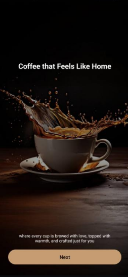

<h1 align="center">☕ VELVETA</h1>

  <em>A cozy and personalized coffee ordering experience — because every cup should feel like home.</em>

---

## 📱 Overview

**VELVETA** is a mobile app UI designed to make enjoying coffee simple, warm, and personal.  
Users can explore different coffee drinks, get mood-based recommendations, save their favorites, and order seamlessly — all in one friendly and elegant app.

---

## ✨ Features

### 🌟 Ideation Highlights
- **Personalized Onboarding** – Warm welcome screen with brand message and mood-based suggestions.  
- **Mood-Based Discovery** – Recommends coffee drinks based on how the user feels.  
- **Categorized Menu** – Organized sections like *Cappuccino, Espresso, Latte* for easy browsing.  
- **Favorites System** – Save and quickly access favorite drinks.  
- **Seamless Checkout** – Smooth flow from cart to payment.

---

## 🎨 UI Design

### 🎨 Color Scheme — *60-30-10 Rule*

| Ratio | Color | Usage |
|-------|--------|--------|
| **60%** | ☕ Light Beige/Brown | Backgrounds, cards, and base UI elements. Creates warmth. |
| **30%** | 🍫 Dark Brown | Text, buttons, icons — ensures clarity and contrast. |
| **10%** | 🧡 Burnt Orange | Highlights and CTAs, like the *Add to Cart* button. |

---

## 🧱 Layout Structure

- **Intro Screens:** Full-screen layouts with centered branding and CTA ("Next", "Get Started").  
- **Authentication:** Simple forms with labeled input fields and full-width buttons.  
- **Dashboard/Menu:** Grid layout (2x2 or 2x3) displaying items with image, title, description, and price.  
- **Detail View:** Single-column layout highlighting product info, size, and quantity options.  
- **Checkout:** List and form layouts for cart, payment, and confirmation screens.

---

## 🧩 UI Components Used

| Component | Purpose |
|------------|----------|
| **TextView** | Titles, descriptions, prices |
| **EditText** | Input fields for login, signup, and payment |
| **Button** | Actions like *Sign In*, *Add to Cart*, *Pay* |
| **ImageView** | Displays coffee product images |
| **RecyclerView/GridView** | Lists menu and favorites items |
| **RadioGroup / RadioButton** | Select coffee size (S, M, L) |
| **NumberPicker / Button Pair** | Adjust quantity (− / +) |

---

## ⚙️ Interactivity

- **Navigation:** “Next”, “Get Started”, “Sign In/Up” buttons.  
- **Category Tabs:** Filter coffee items easily.  
- **Product Actions:** Add to cart, customize size and quantity.  
- **Checkout Flow:** Cart → Payment → Order Confirmation.

---

## 🌈 Creativity Highlights

- ☕ *Mood-Based Recommendations* — unique personalization feature.  
- 🏠 *Warm Brand Theme* — cozy design that makes users feel at home.  
- ✨ *Premium UI* — clean cards, beautiful colors, and intuitive flow.

---

  

- **Platform:** Android (Java/Kotlin)
- **IDE:** Android Studio
- **UI Design:** XML layouts, Material Components
- **Tools:** RecyclerView, ImageView, ConstraintLayout

---

## 📸 Screenshots

  
  
  

  
  

---
## 📫 Contact
- **Email:** officiallahiru.p@gmail.com  
- **GitHub:** [lahiru-priyankara](https://github.com/lahiru-priyankara)  

